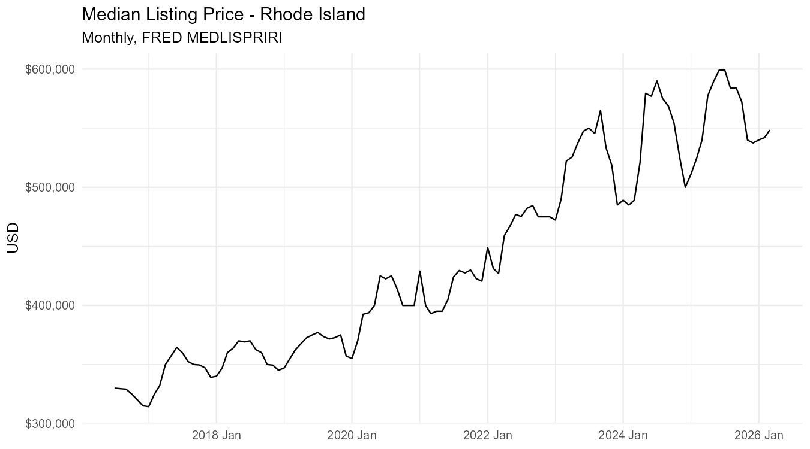
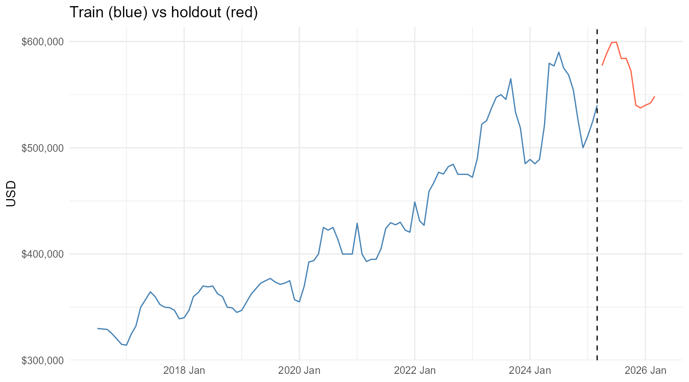
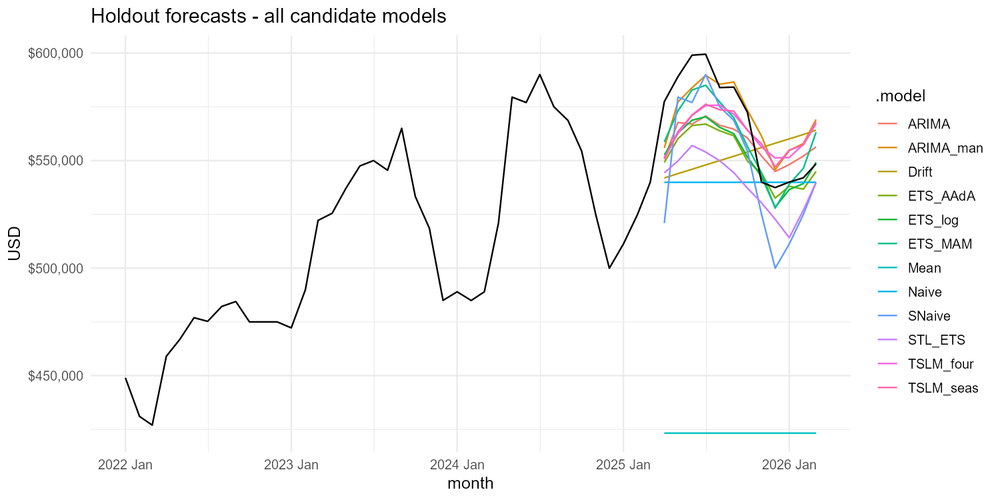
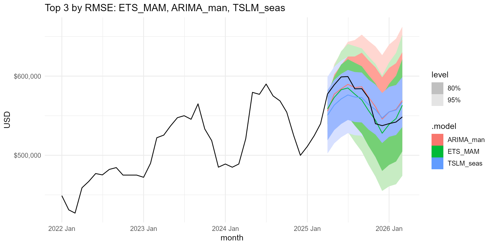
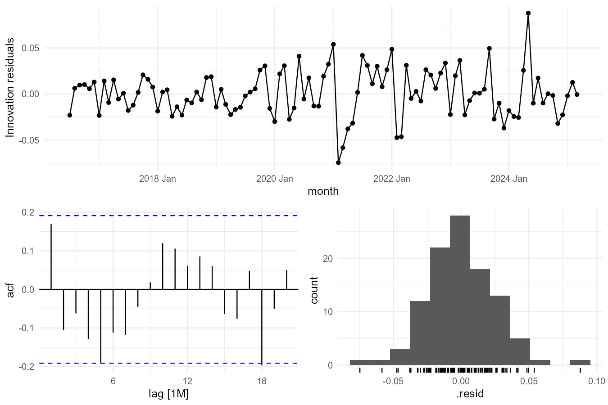
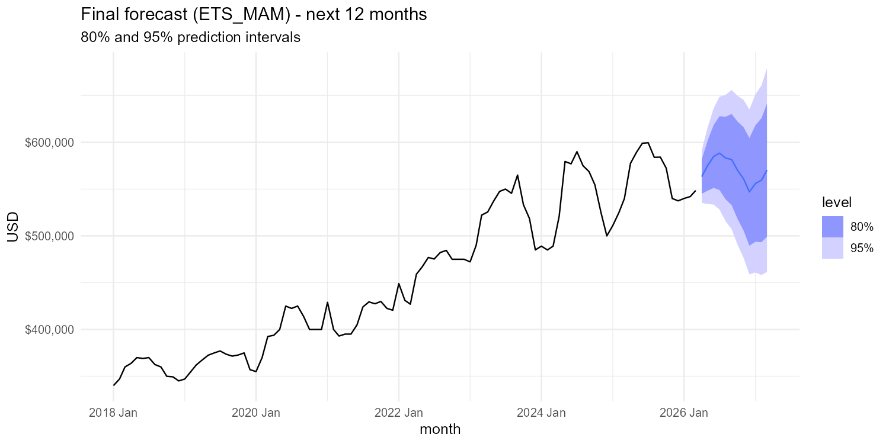

# Forecasting Median Listing Price in Rhode Island
**STAT 645 — Time Series Forecasting · Drexel University · Final Project**

FRED series `MEDLISPRIRI` — monthly median listing price, Rhode Island, Jul 2016 – Mar 2026 (n = 117). Twelve candidate models evaluated on a 12-month holdout; **ETS(M,A,M)** selected as the winner.

---

## Course

| | |
|---|---|
| **Course** | STAT 645 — Time Series Forecasting |
| **School** | LeBow College of Business, Drexel University |
| **Data** | FRED `MEDLISPRIRI` via Zillow / St. Louis Fed |
| **Stack** | R — fpp3, fable, feasts, tsibble, tidyverse |
| **Term** | Spring 2026 |

---

## The Data

| | |
|---|---|
| **Series** | Rhode Island monthly median listing price |
| **Source** | Zillow, distributed by St. Louis Fed (FRED) |
| **Frequency** | Monthly |
| **Window** | Jul 2016 – Mar 2026 |
| **Observations** | 117 (no gaps) |
| **Range** | $314k – $599k (~90% expansion) |

The series captures the 2020–2024 housing boom and the 2025–2026 price softening. STL decomposition reveals a strong upward trend and a mild but consistent annual seasonal pattern — prices firm into summer.

---

## Approach

**Holdout:** last 12 months (~10% of the series), exposing one full seasonal cycle.  
**Metrics:** RMSE, MAE, MAPE, MASE, RMSSE.

| Family | Models |
|--------|--------|
| Toolbox baselines | Mean, Naive, Seasonal Naive, Drift |
| TSLM regression | trend + season dummies; trend + Fourier (K=2) |
| ETS | M-A-M, damped A-Ad-A, log-scale ETS |
| ARIMA | auto ARIMA; seasonal (1,1,1)(0,1,1) |
| STL + ETS | STL decomposition with ETS on the seasonally adjusted series |

---

## Forecast Accuracy — 12-Month Holdout

Sorted by RMSE (lower is better):

| Model | RMSE | MAE | MAPE | MASE |
|-------|-----:|----:|-----:|-----:|
| **ETS_MAM** | **12,658** | **11,346** | **1.97%** | **0.39** |
| ARIMA (manual seasonal) | 14,021 | 12,014 | 2.14% | 0.41 |
| TSLM (season dummies) | 18,694 | 17,446 | 3.06% | 0.60 |
| TSLM (Fourier K=2) | 18,768 | 17,484 | 3.06% | 0.60 |
| ARIMA (auto) | 18,859 | 16,934 | 2.93% | 0.58 |
| ETS (log scale) | 19,175 | 15,817 | 2.72% | 0.54 |
| ETS (damped A-Ad-A) | 20,952 | 17,292 | 2.97% | 0.59 |
| Seasonal Naive | 24,688 | 20,552 | 3.65% | 0.70 |
| STL + ETS | 31,253 | 28,547 | 4.95% | 0.98 |
| Drift | 32,930 | 30,174 | 5.24% | 1.03 |
| Naive | 36,394 | 28,276 | 4.82% | 0.97 |
| Mean | 146,366 | 144,483 | 25.32% | 4.96 |

ETS(M,A,M) beats every baseline and the closest ARIMA challenger by ~1,400 RMSE points. MAPE of 1.97% on a sub-$600k series is roughly ±$12k — competitive for a univariate model with no macro inputs.

---

## Selected Model — ETS(M,A,M)

Multiplicative error, additive trend, multiplicative seasonality. Appropriate for a series with a strong level and proportional seasonal swings.

**Residual diagnostics:**
- ACF: most lags fall within significance bounds
- Residuals roughly symmetric, centred near zero
- Large residuals cluster in 2020–2022 (COVID market shock)
- Ljung-Box (lag 24, df 17): χ² = 29.3, p = 0.0001 — some residual structure remains, attributable to the 2020–22 shock
- Model selection rests on holdout accuracy; prediction intervals carry the residual risk

**Judgment calls:**
- **Transformation:** Guerrero lambda ≈ −0.9 is numerically unstable here — log scale used instead of raw Box-Cox
- **Damped trend included:** The 2025 reversal makes an undamped trend dangerous over 12 months; A-Ad-A was included and accuracy decided
- **ARIMA family added (Ch. 9):** The manual seasonal ARIMA is the closest challenger, which confirms ETS(M,A,M) rather than overturning it
- **Fourier K=2:** Captures the dominant annual cycle with fewer coefficients than 11 monthly dummies

---

## 12-Month Forecast (Apr 2026 – Mar 2027)

Refit on the full series (n = 117). 80% and 95% prediction intervals.

| Month | Point | 80% Low | 80% High | 95% Low | 95% High |
|-------|------:|--------:|---------:|--------:|---------:|
| Apr 2026 | $563,324 | $544,964 | $581,684 | $535,245 | $591,403 |
| May 2026 | $575,029 | $548,277 | $601,781 | $534,116 | $615,943 |
| Jun 2026 | $584,844 | $551,204 | $618,483 | $533,397 | $636,291 |
| Jul 2026 | $588,437 | $548,986 | $627,889 | $528,102 | $648,773 |
| Aug 2026 | $583,190 | $539,066 | $627,314 | $515,708 | $650,672 |
| Sep 2026 | $581,564 | $532,915 | $630,212 | $507,163 | $655,965 |
| Oct 2026 | $570,230 | $518,234 | $622,226 | $490,709 | $649,751 |
| Nov 2026 | $561,007 | $505,822 | $616,193 | $476,609 | $645,406 |
| Dec 2026 | $546,996 | $489,410 | $604,582 | $458,926 | $635,066 |
| Jan 2027 | $556,057 | $493,800 | $618,315 | $460,842 | $651,272 |
| Feb 2027 | $559,510 | $493,226 | $625,793 | $458,138 | $660,881 |
| Mar 2027 | $570,344 | $499,155 | $641,534 | $461,470 | $679,219 |

The model projects a seasonal summer peak near $588k in July 2026, followed by the usual autumn softening. Prediction intervals widen appropriately given the post-boom regime change. The 95% band spans roughly ±$90k by March 2027.

---

## Conclusions

- **ETS(M,A,M)** is the best-performing model — beats all baselines and the seasonal ARIMA on every accuracy metric
- The 2020–2022 COVID shock is the dominant source of residual structure; it cannot be fully absorbed by a univariate model
- The forecast assumes no structural break (interest rate shock, policy change, demand shift)
- Rhode Island's ~90% price run over the sample represents one housing cycle — a longer history would improve long-run uncertainty estimates

**Monitoring:** Refit monthly; flag if standardised residuals drift beyond ±2σ for two consecutive periods.

---

## Files

| File | Description |
|------|-------------|
| [`stat645_final_project.R`](stat645_final_project.R) | Full analysis — data prep, model fitting, holdout evaluation, final forecast |
| [`stat645_final_project.Rmd`](stat645_final_project.Rmd) | R Markdown report |
| [`stat645_final_project.html`](stat645_final_project.html) | Rendered HTML report |
| [`stat645_final_presentation.pptx`](stat645_final_presentation.pptx) | Slide deck |
| [`MEDLISPRIRI.xlsx`](MEDLISPRIRI.xlsx) | Source data (FRED) |
| [`Stat 645 project(2).pdf`](Stat%20645%20project(2).pdf) | Project rubric |
| [`figures/`](figures/) | All exported plots and accuracy / forecast tables |
| [`build_presentation.py`](build_presentation.py) | Script that builds the slide deck from figures |
